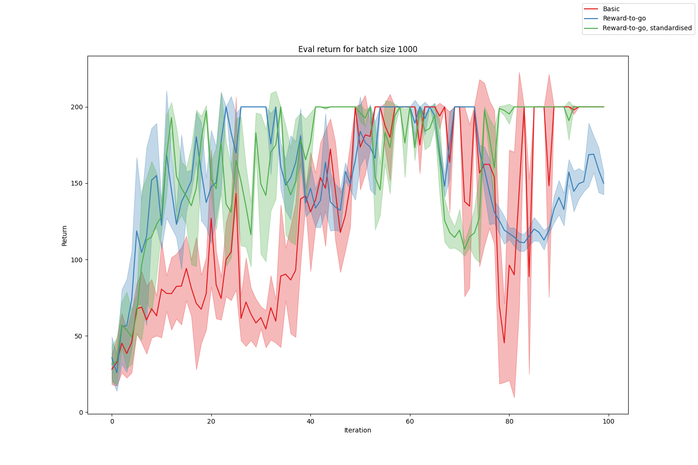
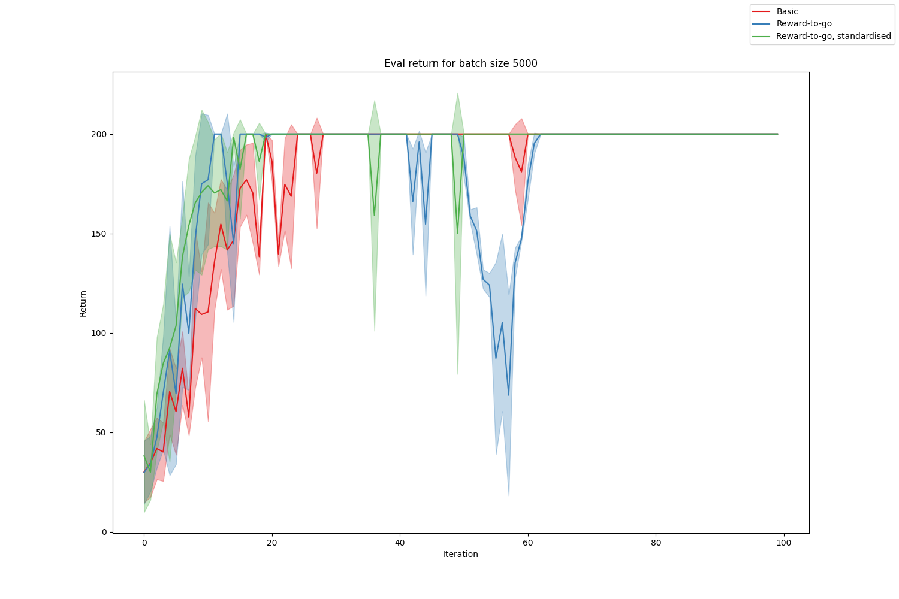

# Homework 2 Report

## Question 1

The figures below show the average eval return through 100 iterations for batch sizes 1000 and 5000 across three variations of policy gradient:
1. Basic policy gradient, which at every timestep uses the sum of the rewards over all timesteps.
2. Policy gradient using reward-to-go.
3. Policy gradient using reward-to-go where we also standardise the advantages before computing the gradient.

|  |
|:--:| 
| *Learning curve for small batches* |

|  |
|:--:| 
| *Learning curve for large batches* |

Conclusions:
- With the smaller batch size of 1000, there's quite a lot of instability, so it's hard to draw strong conclusions.
- Using reward-to-go does however appear to improve performance, both in terms of how quickly the optimal return is approached, and how stable the training is.
- It's unclear if standardising the rewards leads to an improvement in either of these.
- Using the larger batch size of 5000 improves performance considerably. The training converges faster and is more stable. All variations converge to the optimum return by 100 iterations.