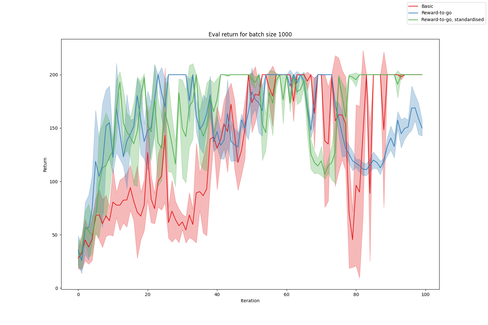
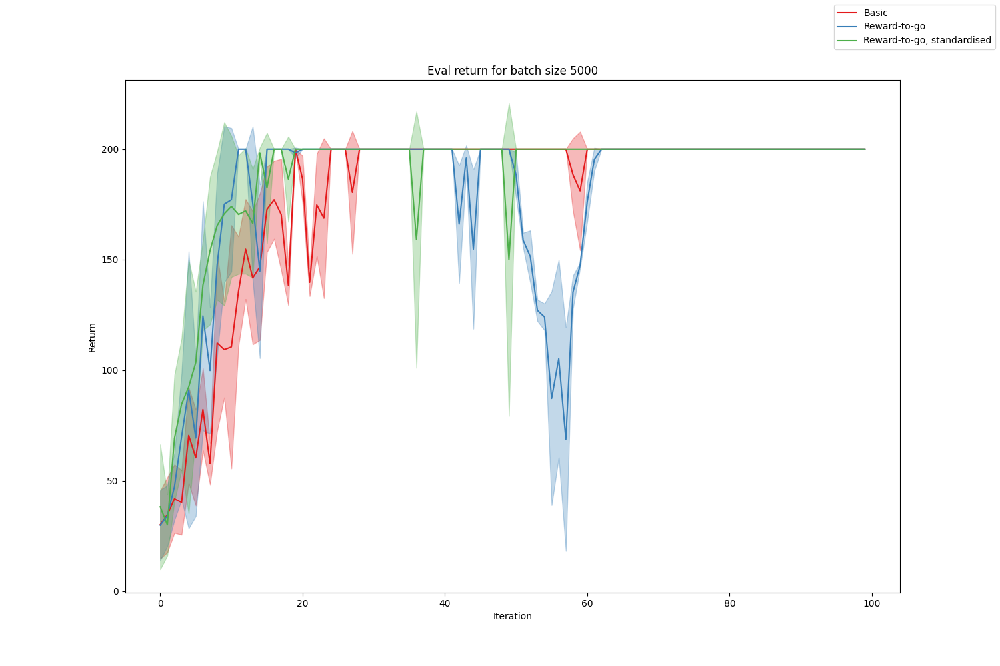
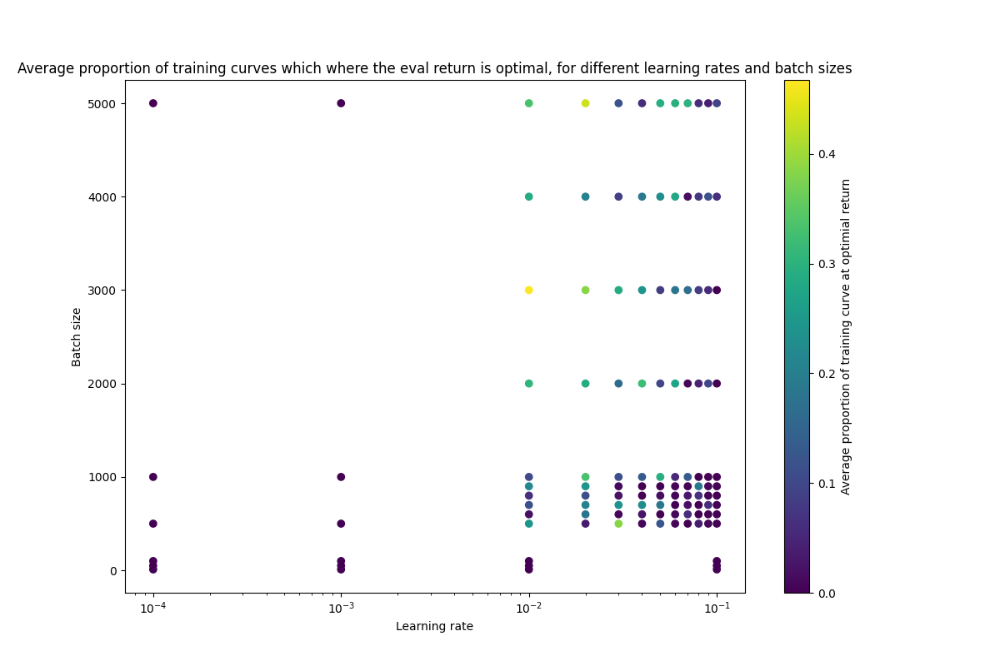
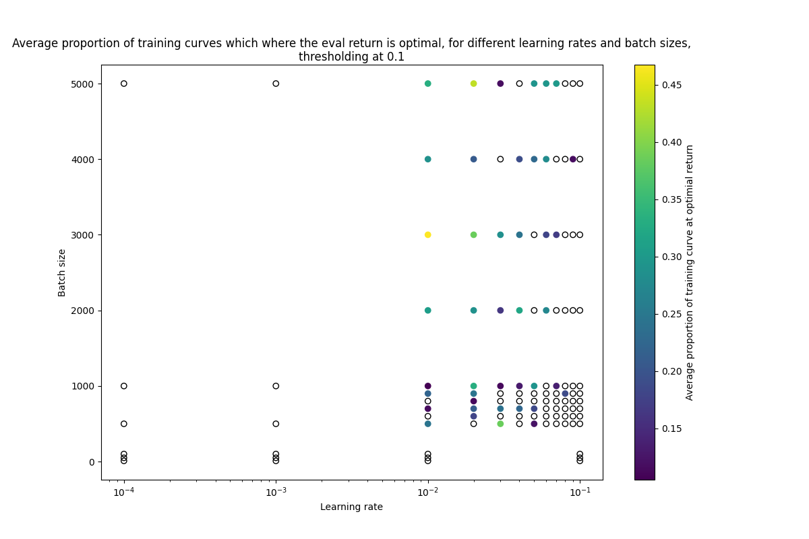
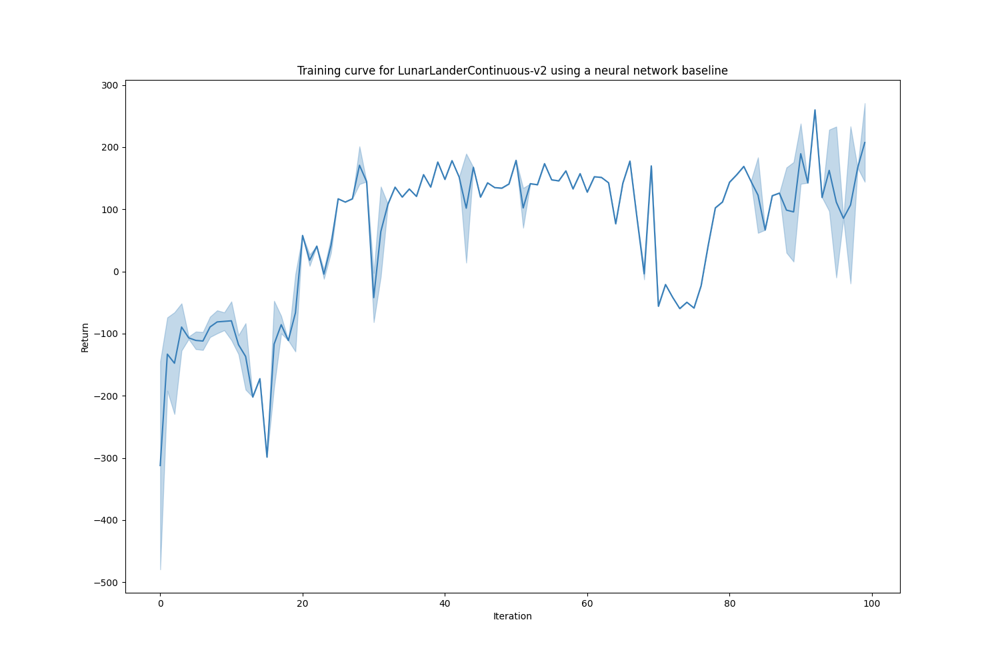
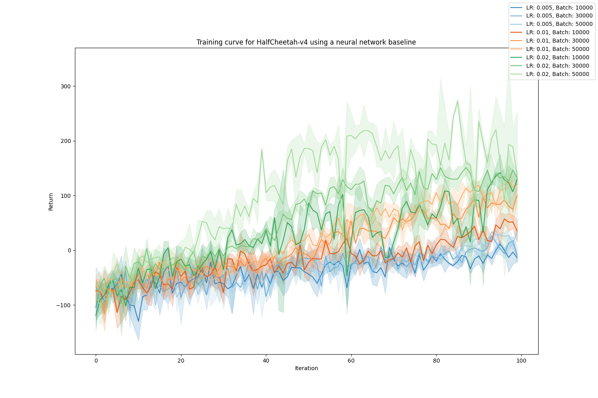
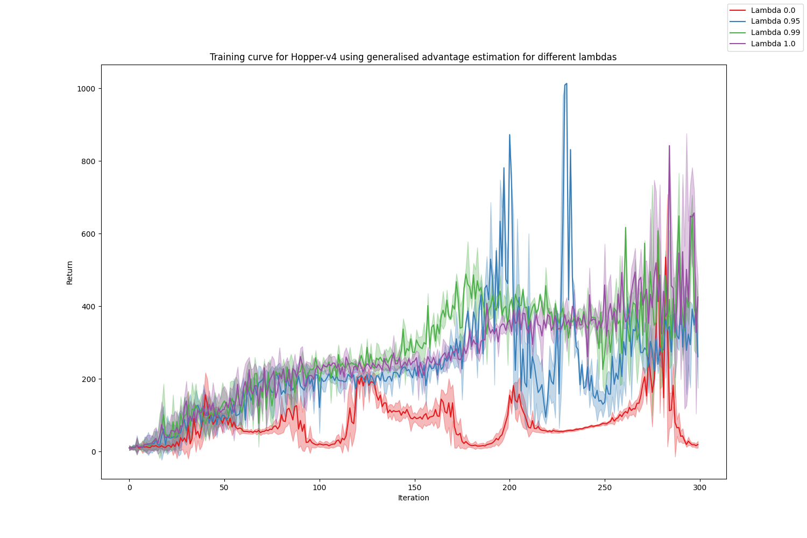
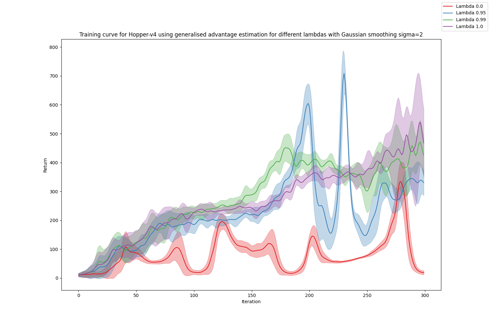

# Homework 2 Report

## Experiment 1

The figures below show the average eval return through 100 iterations for batch sizes 1000 and 5000 across three variations of policy gradient:
1. Basic policy gradient, which at every timestep uses the sum of the rewards over all timesteps.
2. Policy gradient using reward-to-go.
3. Policy gradient using reward-to-go where we also standardise the advantages before computing the gradient.

|  |
|:--:| 
| *Learning curve for small batches* |

|  |
|:--:| 
| *Learning curve for large batches* |

Conclusions:
- With the smaller batch size of 1000, there's quite a lot of instability, so it's hard to draw strong conclusions.
- Using reward-to-go does however appear to improve performance, both in terms of how quickly the optimal return is approached, and how stable the training is.
- It's unclear if standardising the rewards leads to an improvement in either of these.
- Using the larger batch size of 5000 improves performance considerably. The training converges faster and is more stable. All variations converge to the optimum return by 100 iterations.

## Experiment 2

The figures below show the average proportion the training run which on which we receive the optimal return, for different learning rates and batch sizes, which the average taken across four random seeds. The second figure differs from the first in that we replace all points whose average proportion is less than 0.1 by an empty circle. 

|  |
|:--:| 
| *Average proportion of training run attaining the optimal return* |

|  |
|:--:| 
| *Average proportion of training run attaining the optimal return, thresholding at 0.1* |

Conclusions:
- The best set of parameters from those tested is a learning rate of 0.01 and a batch size of 3000.
- The highest learning rate and lowest batch size which gets above the 0.1 threshold is either (0.08, 900) or (0.09, 4000).

## Experiment 3

The following shows the training curve for the `LunarLanderContinuous-v2` environment when using a neural network baseline. It attains an average return of around 180 by the end of training.

|  |
|:--:| 
| *Training curve for LunarLanderContinuous-v2 using a neural network baseline* |

## Experiment 4

I now try `HalfCheetah-v4` using the neural network baseline and reward-to-go, testing various learning rates and batch sizes.

|  |
|:--:| 
| *Training curve for HalfCheetah-v4 using a neural network baseline and reward-to-go across different learning rates and batch sizes* |

Higher learning rates consistently yield better results. For the learning rates 0.005 and 0.01 larger batch sizes give better results. For 0.02 however the best batch size is 30000 (though this has higher variance and doesn't perform as well as 50000 initially).

## Experiment 5

The following graphs show the result of using generalised advantage estimation (GAE) for various values of lambda. The first presents the raw data, the second presents the data smoothed using a Gaussian filter.

|  |
|:--:| 
| *Training curve for Hopper-v4 using generalised advantage estimation for different lambdas* |

|  |
|:--:| 
| *Training curve for Hopper-v4 using generalised advantage estimation for different lambdas with Gaussian smoothing sigma=2* |

The higher the value of lambda the better the final performance. Setting lambda to be 1 (vanilla neural network baseline estimator) yielded the best final performance. However a lambda of 0.95 gave the best maximum performance.